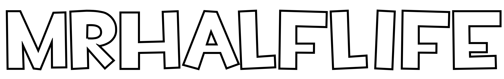

# hi, I am MrHalfLife, nice to see you :)

* Hi, I’m Arman (Online alias: MrHalfLife)
* I’m interested in Coding and IT
* How to reach me: mrhalflife@proton.me
* Pronouns: He/him
* Fun fact: I don't know what to put here
* Birthday: 8th of December

# Projects
Here are projects that I really like that I did
* [HalfTube](https://halftube.neocities.org/) - A mid-2005-based YouTube revival, but the only way you get your content there is via email.
* [HalfBeats](https://github.com/MrHalfLife280/HalfBeats) - A simple Drum Beat maker, coded in Python, and using MIDI.
* [Startpage](https://github.com/MrHalfLife280/Startpage) - A simple Startpage.
* [HalfBlog](https://mrhalflife280.github.io/HalfBlog/) - A Blog hosted under [GitHub Pages](https://pages.github.com/)
* [Calculator](https://mrhalflife280.github.io/Calculator) - A calulator app, that works with PWA

# NOTE (for those who use Edge or Chromium-based browsers)

Some browsers, like Edge, may say that my compiled programs are "malicious." You can check the source code. This usually happens because the compiled .exe doesn't have a signature.

# What I like to do in my free time

I love playing TF2, animating in Source Filmmaker, and editing videos in DaVinci Resolve, making music, and sometimes code, but not always

<!---
MrHalfLife280/MrHalfLife280 is a ✨ special ✨ repository because its `README.md` (this file) appears on your GitHub profile.
You can click the Preview link to take a look at your changes.
--->
